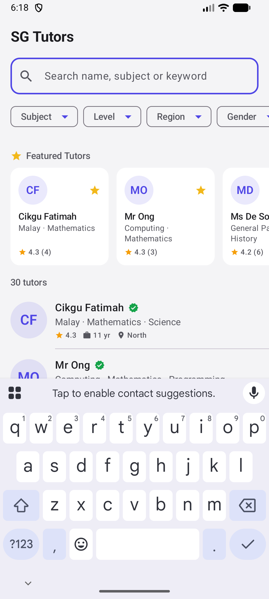
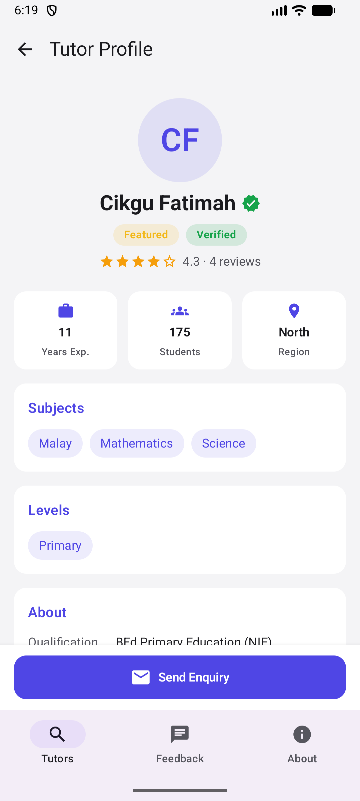
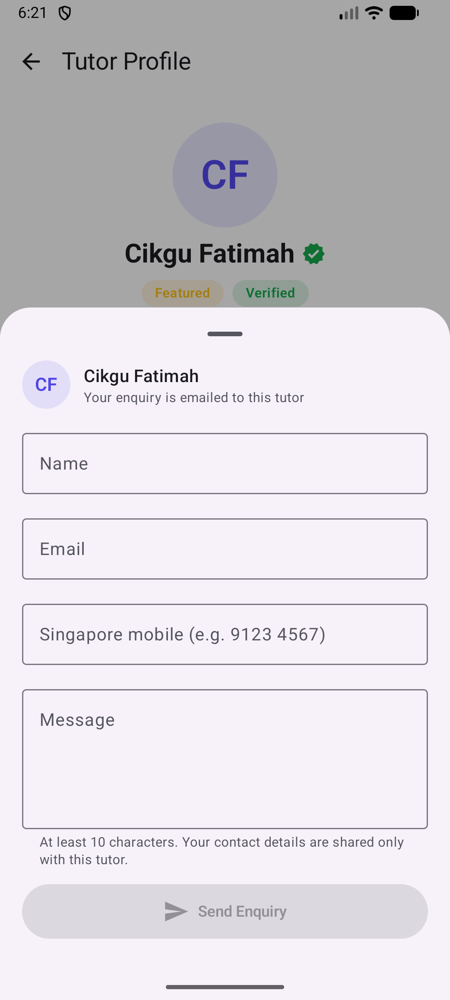
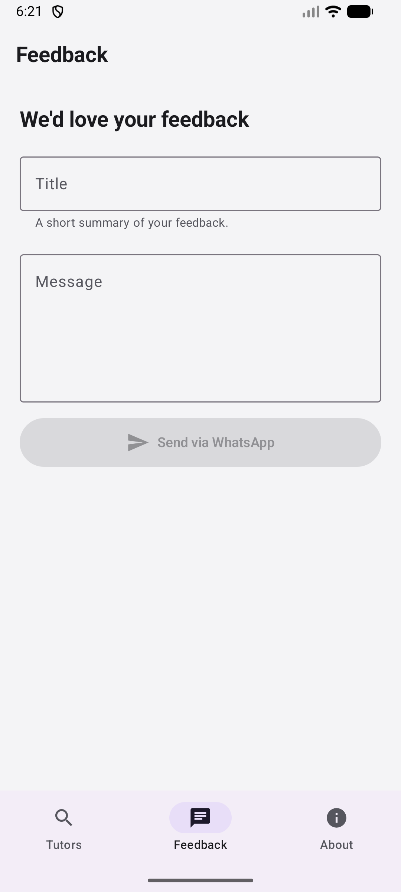
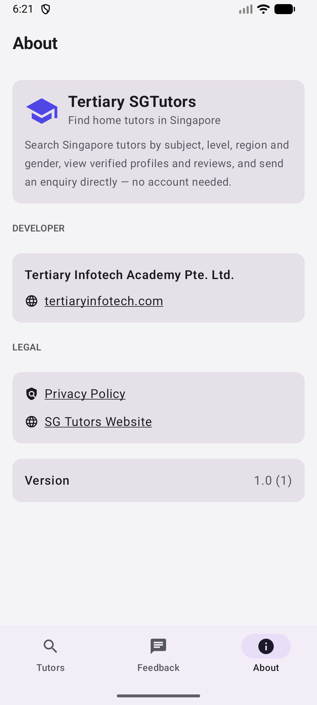

# Tertiary SGTutors — Android


Native Android app for **[SG Tutors](https://sgtutors.tertiaryinfotech.com)** — find home tutors in Singapore. Search tutors by subject, level, region and gender, view verified profiles and reviews, and send an enquiry directly to a tutor — no account needed.

The companion iOS app (SwiftUI) lives in a separate repository/folder; this repo contains the Android app only.

## Screenshots

| Home | Tutor Profile | Enquiry | Feedback | About |
|------|---------------|---------|----------|-------|
|  |  |  |  |  |

## Features

- **Tutor search** — full-text search with debounce, plus Subject / Level / Region / Gender filter chips
- **Featured tutors** — horizontally scrolling featured carousel
- **Infinite scroll** — paged results loaded as you scroll
- **Tutor profile** — verified/featured badges, star ratings, stats (experience, students taught, region), subjects, levels, education background, and reviews
- **Direct enquiry** — validated enquiry form (Singapore mobile number check) emailed straight to the tutor
- **Feedback via WhatsApp** — send app feedback to Tertiary Infotech over WhatsApp
- **Material 3** — indigo brand theme with full light/dark mode support

## Architecture

```
app/src/main/java/com/alfredang/sgtutors/
├── MainActivity.kt            # Single-activity Compose host
├── Models.kt                  # kotlinx.serialization data models (public API shape)
├── ApiClient.kt               # OkHttp client for the SG Tutors public API
├── TutorSearchViewModel.kt    # Search state, filters, debounce, paging
└── ui/
    ├── Theme.kt               # Material 3 theme (indigo brand palette)
    ├── RootScreen.kt          # Bottom navigation: Tutors / Feedback / About
    ├── TutorsHomeScreen.kt    # Search, filters, featured carousel, tutor list
    ├── TutorDetailScreen.kt   # Profile, stats, subjects, levels, reviews
    ├── EnquirySheet.kt        # Modal bottom-sheet enquiry form
    ├── FeedbackScreen.kt      # WhatsApp feedback form
    └── AboutScreen.kt         # App info, developer, legal links, version
```

- **UI:** Jetpack Compose + Material 3, single-activity, state-driven navigation
- **Networking:** OkHttp + kotlinx.serialization against `https://sgtutors.tertiaryinfotech.com/api`
- **Images:** Coil (`SubcomposeAsyncImage`) with initials-avatar fallback
- **Min SDK 26 (Android 8.0) · Target SDK 36**

## Getting Started

### Prerequisites

- Android SDK (API 36) — set `sdk.dir` in `local.properties`
- JDK 17+ (Android Studio's bundled JBR works)
- Gradle 9+ (or open the project in Android Studio)

### Build & Run

```bash
# Debug build
gradle :app:assembleDebug

# Install on a connected device/emulator
adb install -r app/build/outputs/apk/debug/app-debug.apk

# Release bundle for Google Play (requires keystore.properties)
gradle :app:bundleRelease
```

`keystore.properties` (not committed) supplies the release signing config:

```properties
storeFile=upload-keystore.jks
storePassword=***
keyAlias=sgtutors-upload
keyPassword=***
```

## API

The app consumes the read-only public API of the SG Tutors platform:

| Endpoint | Purpose |
|----------|---------|
| `GET /api/tutors` | Paged tutor search (`q`, `subject`, `level`, `region`, `gender`, `page`) |
| `GET /api/tutors/featured` | Featured tutors |
| `GET /api/tutors/{id}` | Tutor profile |
| `GET /api/tutors/{id}/reviews` | Paged reviews |
| `GET /api/subjects` · `GET /api/levels` | Filter option lists |
| `POST /api/tutors/{id}/enquiries` | Send an enquiry to a tutor |

Only whitelisted, non-sensitive tutor fields are ever returned by the server.

## Legal

- [Privacy Policy](https://sgtutors.tertiaryinfotech.com/privacy)
- [SG Tutors Website](https://sgtutors.tertiaryinfotech.com)

## Acknowledgements

Developed by **[Tertiary Infotech Academy Pte. Ltd.](https://www.tertiaryinfotech.com)**

Built with Jetpack Compose, Material 3, OkHttp, kotlinx.serialization and Coil.
